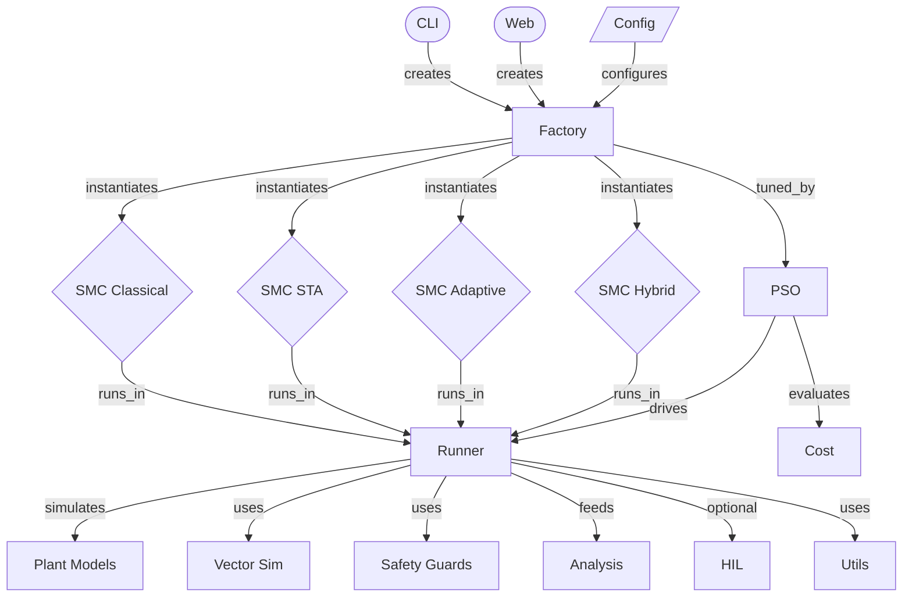

# SMC-PSO-beta Architecture Dashboard

Welcome to the interactive Obsidian representation of the **SMC-PSO-beta** codebase.

> [!info] Vault Statistics
> - **Nodes**: 17 (code modules/layers)
- **Edges**: 20 (import & structural relationships)
- **Generated**: `2026-06-23`

---

## Visual System Map
Double-click any box below (in Reading view) to preview relations:

---

> [!star] Key Hubs (Most Connected Modules)
- [[runner|Runner]] (`module`, degree: 11) — Simulation runner / orchestrator / context
- [[factory|Factory]] (`module`, degree: 8) — Type-safe controller factory
- [[pso|PSO]] (`module`, degree: 3) — PSO gain tuner
- [[smc_classical|SMC Classical]] (`controller`, degree: 2) — Classical SMC (boundary layer)
- [[smc_sta|SMC STA]] (`controller`, degree: 2) — Super-twisting SMC
- [[smc_adaptive|SMC Adaptive]] (`controller`, degree: 2) — Adaptive SMC (online tuning)

---

## System Layers & Folders
### [[config/|Config]] (1 nodes)
  [[config|Config]]
### [[controller/|Controller]] (4 nodes)
  [[smc_classical|SMC Classical]] · [[smc_sta|SMC STA]] · [[smc_adaptive|SMC Adaptive]] · [[smc_hybrid|SMC Hybrid]]
### [[entrypoint/|Entrypoint]] (2 nodes)
  [[cli|CLI]] · [[web|Web]]
### [[module/|Module]] (10 nodes)
  [[runner|Runner]] · [[factory|Factory]] · [[pso|PSO]] · [[plant_models|Plant Models]] · [[vector_sim|Vector Sim]]

---

## Quick Tips
1. **Obsidian Canvas**: Check the [[SMC-PSO-beta.canvas|Visual white-board canvas]] for an interactive, layed-out diagram.
2. **Graph View**: Open `Ctrl + G` inside Obsidian to see an active simulation of your imports.
3. **Local File Links**: Clicking the `[open file]` links in node metadata will launch that file in your IDE directly.